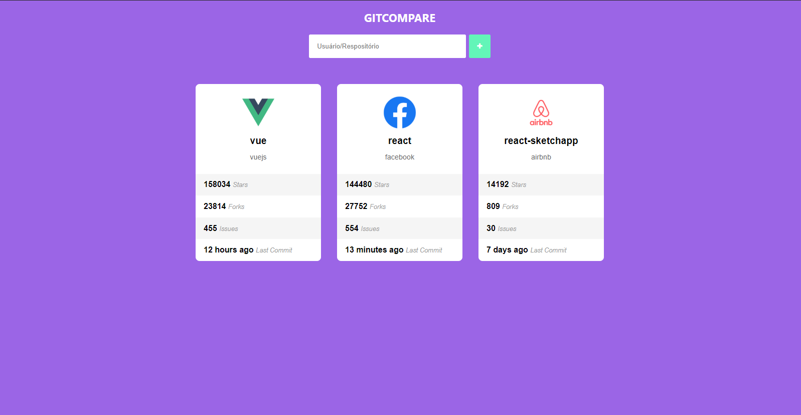

<h2 align="center">Github Compare</h2>

<p align="center">
 </a>
</p>

## Projeto 📋

<p>O GitCompare é um comparador de repositórios, no qual ele exibe suas informações como número de "starts", "issues" e último "commit", por exemplo.</p>

## Conceitos abordados ✏️

- Estruturação de pastas
- Componentes e seus estados e propriedades
- PropTypes
- Styled Components
- Axios
- Async/Await

## Dependências 🧰

> Utilizei o Yarn como gerenciador de pacotes!

```
yarn add styled-components
yarn add prop-types
yarn add axios
yarn add moment
yarn add font-awesome
```

## Autor 🙋🏻‍♂️

💁🏻‍♂️ **Lucas Alvarenga**

* Meu Portfólio: https://alvarengadev.firebaseapp.com
* Github: [@Alvarenga-Dev](https://github.com/Alvarenga-Dev)

## Dá uma estrelinha! ⭐️

Copyright © 2019 [Lucas Alvarenga](https://github.com/Alvarenga-Dev). <br/>
